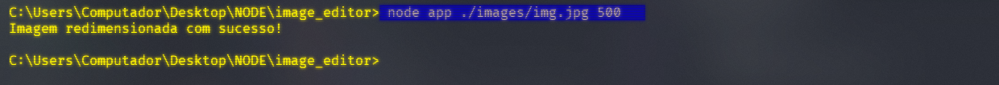

# Resizer Img

 
 

<h1>
 What i've done ?
</h1>

 I made a resizer of images using just javascript. It's necessary know a litle bit of JS code for use my package, maybe in the future, i will put this package on <b>NPM</b> website and his server. But now, i hope you enjoy. Comments new features to atributte this package, for turn it more bigger and useful.

 
 

<h1>
    Requirements:
</h1>
<ul>
    <li> Know JS code
    <li> node.js
    <li> know a litle bit command line code
</ul>

 
 

    node app ./images/img.jpg 500

 
 

